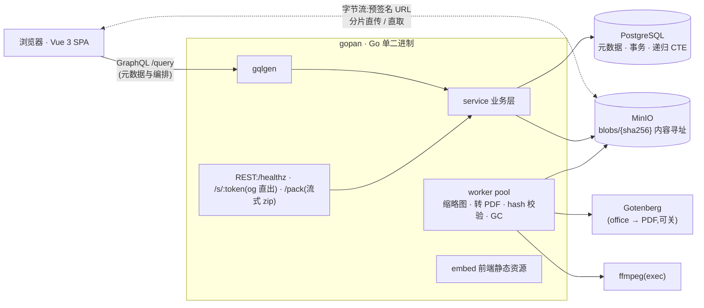

# gopan

自部署云盘。Go + GraphQL + Postgres + MinIO 后端,Vue 3 前端,单二进制交付。

**在线实例**:<https://drive.979687.xyz>(跑在 2 核 2G 的 VPS 上,精简档部署)

<!--
截图待补。拍好放 doc/assets/ 后取消下面的注释即可(浏览器窗口 1280 宽,浅色主题):
1. drive.png   — 主目录页:混合类型文件(图片有缩略图)、右键菜单打开
2. upload.png  — 上传抽屉:3 个以上任务,含进行中(有速度)/暂停/完成三种状态
3. preview.png — 图片或视频预览模态
4. share.png   — 分享访客页(输密码那屏或文件列表屏)

| | |
|---|---|
|  |  |
|  |  |
-->

当前阶段:**v1.2.0——v1 已上线(2026-07-12,踩坑复盘见 doc/10),v2 推进中**(M7 管理端、M8 规模已交付,规划见 doc/13)。部署走 doc/09 上线手册,分全家桶 / 精简两档,2G 小机可关 Gotenberg 与自带反代。功能:分片直传/秒传/断点续传、图片/音视频/PDF/文本/Office 预览、文件与文件夹分享(密码、有效期、访客只读子树)、打包下载、回收站、双 token 认证、管理端。

## 架构



要点:**字节流不过 Go**——上传是浏览器拿预签名 URL 分片直传 MinIO,下载/预览直连预签名 GET,唯一经过 Go 的字节流是 /pack 流式 zip。文件按 SHA-256 内容寻址,全站同内容物理只存一份(秒传),配额按逻辑大小各记各的。类型从数据库到组件不断链:sqlc(SQL→Go)、gqlgen(schema→resolver)、GraphQL Code Generator(schema→TS),改一处两端编译报错。

## 快速开始

```bash
make dev-env      # compose 起 postgres/minio/gotenberg
make dev-server   # 后端 :8080(自动跑迁移)
make dev-web      # 前端 :5173(proxy → 8080)

make gen          # 改了 schema.graphqls / db/queries 后重新生成三件套
make test         # go test + vet(集成测试需 TEST_DB_URL)
make build        # 前端构建 + embed → server/gopan 单二进制
```

生产运行只需要 `server/gopan` 二进制 + `GOPAN_DB_URL` + `GOPAN_JWT_SECRET`(≥32 字节),配置项见 doc/08。

## 设计文档

全部设计文档在 [doc/](./doc/):

| 文档 | 内容 |
|---|---|
| [01 · 需求与范围](./doc/01-需求与范围.md) | v1 功能清单、明确不做的、非功能要求、术语表 |
| [02 · 技术选型](./doc/02-技术选型.md) | 前后端选型表、不用什么及理由 |
| [03 · 架构与核心流程](./doc/03-架构与核心流程.md) | 组件图;上传(秒传/分片/断点)、下载、预览、分享、GC 流程 |
| [04 · 数据模型](./doc/04-数据模型.md) | Postgres 全量 DDL、不变量、容量估算 |
| [05 · GraphQL 设计](./doc/05-GraphQL设计.md) | 完整 SDL(接口唯一事实源)、约定、resolver 要点 |
| [06 · 认证与安全](./doc/06-认证与安全.md) | 双 token 细节、访客授权、预签名边界、限速 |
| [07 · 前端设计](./doc/07-前端设计.md) | 路由/组件/store 划分、上传器状态机、token 处理层 |
| [08 · 项目结构与部署](./doc/08-项目结构与部署.md) | 仓库布局、开发流、compose、运维、里程碑 |
| [09 · 上线手册](./doc/09-上线手册.md) | 从裸机到可用:部署/升级/回滚/备份恢复/排障/配置速查 |
| [10 · 真机部署复盘](./doc/10-真机部署复盘.md) | 首次真机部署踩的坑与教训、新机检查清单 |
| [11 · 使用手册](./doc/11-使用手册.md) | 面向使用者:上传/预览/分享/回收站怎么用、常见问题 |
| [12 · 产品说明](./doc/12-产品说明.md) | 定位、功能总览、能力边界、数据与安全、同类对比 |
| [13 · v2 规划](./doc/13-v2规划.md) | M7 管理端 → M8 规模(keyset/子树统计)→ M9 WebDAV,原则与取舍 |

## 实现回顾

每个里程碑实际交付了什么、关键决策、踩坑记录,在 [doc/milestones/](./doc/milestones/):

| 里程碑 | 内容 |
|---|---|
| [M1 · 骨架](./doc/milestones/M1-骨架.md) | 双 token 认证、目录树 CRUD、三条代码生成链、embed 单二进制 |
| [M2 · 传输](./doc/milestones/M2-传输.md) | 分片直传、秒传、断点续传、hash 校验与谎报回收、自研上传器 |
| [M3 · 预览](./doc/milestones/M3-预览.md) | 派生物管线(缩略图/封面/时长/Office 转 PDF)、预览模态 |
| [M4 · 分享](./doc/milestones/M4-分享.md) | 分享链接、访客子树授权、og 落地页、流式 zip 打包 |
| [M5 · 收尾](./doc/milestones/M5-收尾.md) | 欠账清零(回收站自动清理/复制/搜索/配额/改密码)+ Docker 生产化 |
| [M6 · 加固](./doc/milestones/M6-加固.md) | 测试 64%→73%、/pack 双闸限速、refresh 清理、深度限制、/metrics、安全头、smoke 入库 |
| [M7 · 管理端](./doc/milestones/M7-管理端.md) | 建号/配额/禁用(分享连带失效)/重置密码/概览,CLI promote 自举;v1.1.0 |
| [M8 · 规模](./doc/milestones/M8-规模.md) | keyset 分页(深页 31ms→7.5ms 且不随深度退化)、文件夹体积异步统计;v1.2.0 |
| [M9 · WebDAV](./doc/milestones/M9-WebDAV.md) | 应用密码、流式转存走 verify 管线、rclone 真实验收;v1.3.0,v2 收官 |

## 读法

想看全貌:01 → 02 → 03,或者直接读 12(产品说明,一页版)。要动手:04、05 是实现的两份合同。想知道每步实际怎么落地的:doc/milestones/ 按序读(实际执行为 M1~M6,08 末尾的四段划分是设计期建议)。要部署:doc/09 照着走,装新机前先扫一遍 doc/10 的检查清单。只是用:doc/11 使用手册。
